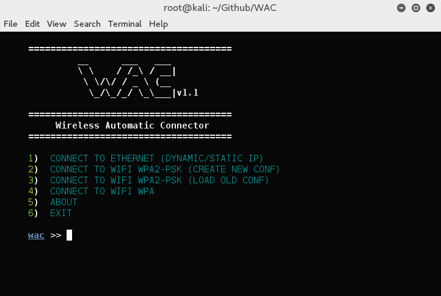

# WAC
WAC (Wireless Automatic Connector) is an bash script which is using to connect ethernet, wifi wpa or wpa-2psk quickly and easily.

# How to run?

* sudo chmod +x WAC.sh

* sudo ./WAC.sh

# Preview

# Thanks

+ Phantom1212
